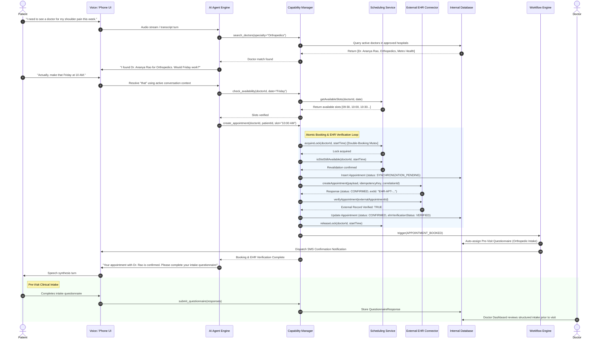

# Booking Sequence & Lifecycle Flow

## Sequence Diagram

The following diagram illustrates the complete, connected lifecycle from the patient's spoken request to external EHR verification and pre-visit intake assignment:

